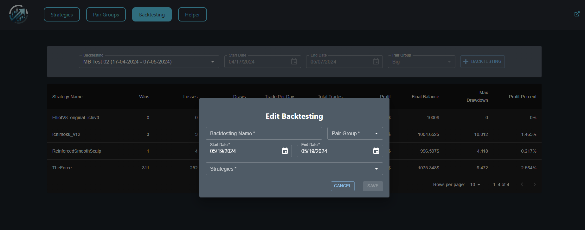
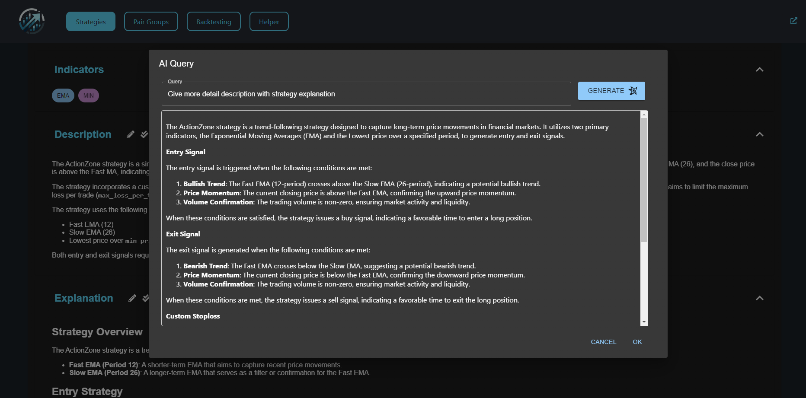
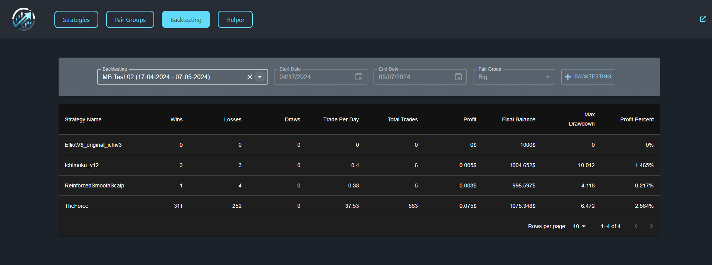
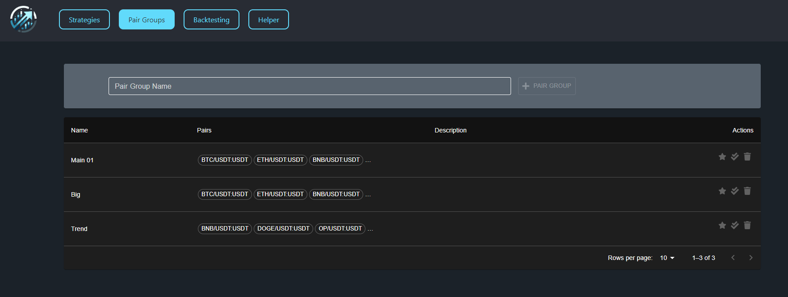
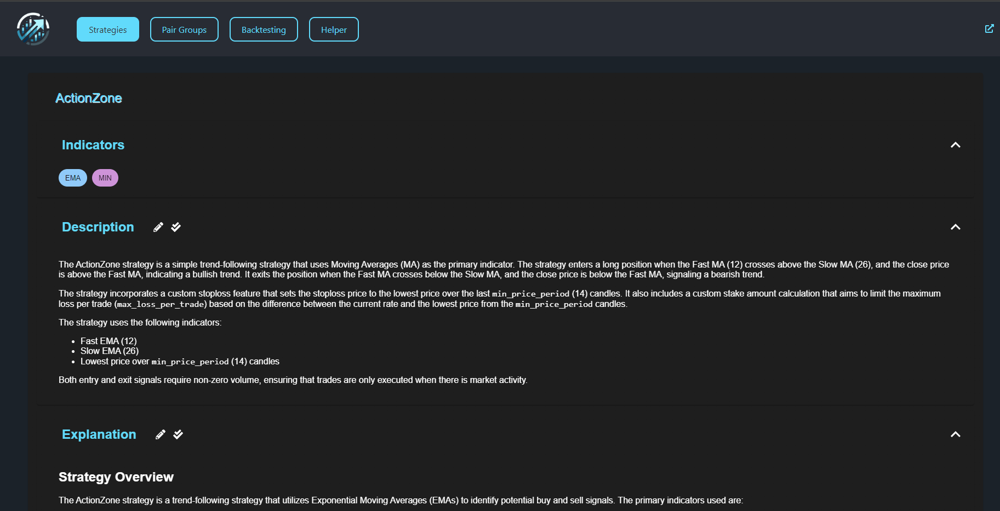

# AI Powered Freqtrade Strategies Builder

## What is this?

<table>
    <tr>
        <td>
            
        </td>
        <td>
            
        </td>
        <td>
            
        </td>
    </tr>
    <tr>
        <td>
            
        </td>
        <td colspan="2" align="center">
            
        </td>
    </tr>
</table>

This application leverages the power of artificial intelligence to enhance the functionality of FreqTrade, an open-source cryptocurrency trading bot. It is designed to analyze and explain FreqTrade strategies, assist in the creation of custom trading strategies, and streamline the process of backtesting multiple strategies simultaneously. The application provides a user-friendly web interface that displays the results of backtests clearly and efficiently, making it easier for users to make informed trading decisions.

## Features

### AI-Powered Strategy Analysis

**Strategy Explanation**: Understand the mechanics and logic behind each trading strategy through detailed AI-generated explanations.
**Example Generation**: Get practical examples of how each strategy operates under different market conditions.

### Strategy Development Support

**Custom Strategy Builder**: Utilize AI assistance to craft tailored FreqTrade strategies that align with your trading preferences and goals.

### Advanced Backtesting Capabilities

**Batch Backtesting**: Conveniently run backtests on a collection of strategies to evaluate their performance over specific historical data.
**Results Visualization**: Access a comprehensive web UI that displays backtesting outcomes, helping you visualize the effectiveness of each strategy.

By integrating these features, the application aims to provide a robust toolset for both novice and experienced traders to optimize their trading strategies in the cryptocurrency markets.

## Technical

Our application is built using a robust stack of modern technologies designed to ensure scalability, performance, and user-friendliness:

### Programming Language & Frameworks:

**Python**: The core programming language used for developing the application.
**FastAPI**: Employs this modern, fast web framework for building APIs with Python 3.7+.
**React**: Utilizes this JavaScript library for building the interactive user interface.

### AI & Machine Learning:

**Langchain**: Leverages this toolkit to integrate language models effectively within the application.
**Anthropic AI**: Integrates this AI service for advanced model understanding and generation capabilities.

### Database & Storage:

**MongoDB**: Utilizes this NoSQL database for efficient data management and storage.
**CosmosDB for MongoDB**: Employs Azure’s fully managed database service with MongoDB compatibility for enhanced scalability and reliability.

### Hosting & Deployment:

**Azure App Service**: Hosts the application on Microsoft's cloud computing service for secure and scalable web application deployment.

## Function Availability

### Currently Disabled Functions:

- **Add Strategy:** The ability to add new trading strategies is currently disabled.
- **Run Backtesting:** Running backtesting for strategies is not available.
- **Add Pair Group:** The functionality to add new pair groups has been disabled.
- **Show Backtesting Result for Each Strategy:** Detailed backtesting results for individual strategies are not currently displayed.

### Available Functions:

- **Strategy Analysis Using AI Service:** Deeply analyze strategies using advanced AI tools to provide comprehensive insights.
- **Backtesting Batch Results:** View results from batch backtests to compare the performance of multiple strategies.
- **Pair Group Management:** Manage and configure pair groups that are essential for strategy execution.

## Contact Me

- **Website**: [https://maobui.online](https://maobui.online)
- **Email**: [maonguyen199873@gmail.com](mailto:maonguyen199873@gmail.com)

## Resources

- **Open Source Strategies Repository**: [https://github.com/MaoBui2907/freqtrade-strategies](https://github.com/MaoBui2907/freqtrade-strategies)
